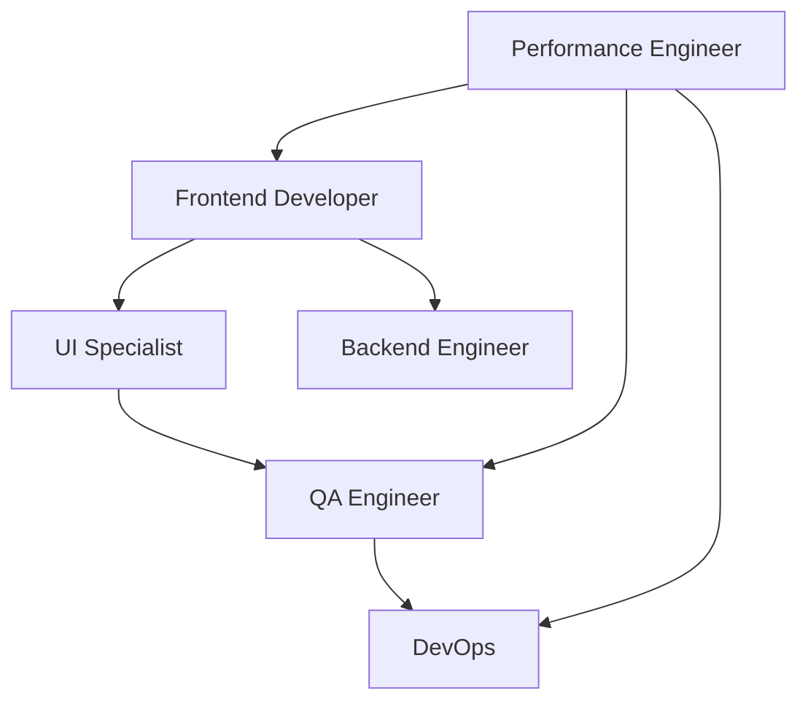

# Week 3 Performance Optimization: Team Assembly & Capability Analysis
## Using CLEAR Framework with Systems Intelligence

## Executive Summary

The Week 3 Performance Optimization initiative has been enhanced using the CLEAR framework (Context, Language, Examples, Artifacts, Rubrics) and requires a sophisticated multi-agent team assembly to achieve aggressive performance targets. This document provides the capability-network analysis and team composition recommendations.

## Performance Initiative Overview

### Quantitative Targets (Business Critical)
- **67% reduction** in load times (5-6s → <2s)
- **60 FPS sustained** scrolling performance  
- **44% reduction** in memory usage (<100MB for 20+ videos)
- **67% faster** search response (<100ms)
- **100% improvement** in mobile performance (30+ FPS)

### Timeline
- **Duration**: 5 days (40 hours) focused performance engineering
- **Phases**: Progressive enhancement with daily validation gates
- **Risk Level**: Medium-High due to aggressive targets

---

## Capability Requirements Analysis

### Day 1: Lazy Loading Infrastructure (Foundation)

#### Required Capabilities
- **Intersection Observer API Mastery** (Critical)
  - Implementation of viewport-based loading strategies
  - Buffer zone configuration for preloading
  - Performance monitoring integration

- **React Hooks Expertise** (Critical)
  - Custom hook development
  - State management optimization
  - Memory leak prevention

- **Image Optimization** (High)
  - WebP format implementation
  - Progressive JPEG strategies
  - Responsive image serving

- **Virtual Scrolling Architecture** (High)
  - DOM virtualization techniques
  - Scroll position tracking
  - Frame rate optimization

#### Risk Factors
- Browser compatibility issues (Medium probability, High impact)
- Memory management complexity (High probability, Medium impact)
- Performance regression in edge cases (Low probability, High impact)

### Day 2: Advanced Lazy Loading Features

#### Required Capabilities
- **Predictive Loading Algorithms** (Critical)
  - User behavior pattern analysis
  - Machine learning integration potential
  - Cache management strategies

- **Adaptive Quality Systems** (Critical)
  - Device capability detection
  - Network speed monitoring
  - Real-time quality adjustment

- **Content Prioritization Engine** (High)
  - Scoring algorithm development
  - Queue management systems
  - Resource allocation optimization

### Day 3: Rendering Optimization

#### Required Capabilities
- **React Performance Patterns** (Critical)
  - Memoization strategies (React.memo, useMemo, useCallback)
  - Component splitting techniques
  - Render phase optimization

- **Remotion-Specific Optimization** (Critical)
  - Video rendering pipeline understanding
  - Frame caching strategies
  - Composition optimization

- **Bundle Optimization** (High)
  - Code splitting implementation
  - Tree shaking configuration
  - Dynamic import strategies

### Day 4: Search & Filter Performance

#### Required Capabilities
- **Search Algorithm Optimization** (Critical)
  - Indexing strategies
  - Debouncing/throttling implementation
  - Worker thread utilization

- **State Management Optimization** (High)
  - Redux/Context optimization
  - Selective re-rendering
  - Immutability patterns

### Day 5: Final Optimization & Testing

#### Required Capabilities
- **Performance Testing Expertise** (Critical)
  - Lighthouse automation
  - Custom performance metrics
  - Cross-browser testing

- **Production Monitoring** (Critical)
  - Real User Monitoring (RUM) setup
  - Performance budgets enforcement
  - Alert configuration

---

## Team Composition Recommendation

### Primary Team Assembly

#### 1. **Performance Engineer (Lead)**
**Agent**: `performance-engineer`
**Role**: Technical lead and optimization architect
**Capabilities**:
- Deep profiling expertise
- Performance bottleneck identification
- Optimization pattern library
- Measurement framework design

**Responsibilities**:
- Overall performance architecture
- Daily performance validation
- Risk mitigation strategies
- Team coordination

#### 2. **Frontend Developer (Core)**
**Agent**: `frontend`
**Role**: React and UI implementation specialist
**Capabilities**:
- React 18+ expertise
- Component optimization patterns
- State management mastery
- Accessibility compliance

**Responsibilities**:
- Lazy loading implementation
- Component optimization
- Virtual scrolling development
- UI/UX performance balance

#### 3. **UI Implementation Specialist**
**Agent**: `ui`
**Role**: Visual performance and user experience optimizer
**Capabilities**:
- Psychological mastery of perceived performance
- Progressive enhancement strategies
- Loading state design
- Animation performance

**Responsibilities**:
- Loading state implementations
- Smooth transition effects
- Mobile-first optimizations
- User feedback systems

#### 4. **QA Engineer**
**Agent**: `qa`
**Role**: Performance validation and testing automation
**Capabilities**:
- Performance testing frameworks
- Cross-browser testing
- Mobile device testing
- Regression prevention

**Responsibilities**:
- Automated performance tests
- Daily validation gates
- Cross-platform verification
- Performance regression monitoring

### Supporting Team Members

#### 5. **Backend Engineer** (On-call)
**Agent**: `backend`
**Role**: API optimization and CDN configuration
**When Needed**: Days 2-3 for adaptive loading backend support

#### 6. **DevOps Specialist** (On-call)
**Agent**: `devops`
**Role**: Infrastructure and deployment optimization
**When Needed**: Day 5 for production deployment and monitoring

---

## Capability Network Analysis

### Synergy Patterns

#### High Synergy Combinations
1. **Performance Engineer + Frontend Developer**
   - Shared understanding of React internals
   - Collaborative bottleneck resolution
   - Joint optimization strategies

2. **UI Specialist + QA Engineer**
   - User experience validation
   - Performance perception testing
   - Cross-device verification

3. **Frontend Developer + UI Specialist**
   - Component architecture alignment
   - Performance-design balance
   - Progressive enhancement coordination

### Dependency Management



### Communication Protocols

#### Daily Sync Structure
- **Morning**: Performance metrics review (15 min)
- **Midday**: Implementation checkpoint (10 min)
- **Evening**: Validation results and next steps (15 min)

#### Escalation Path
1. Implementation blocker → Performance Engineer
2. Design conflict → UI Specialist + Frontend Developer
3. Test failure → QA Engineer → Performance Engineer
4. Infrastructure issue → DevOps

---

## Risk Assessment & Mitigation

### Technical Risks

| Risk | Probability | Impact | Detection | Mitigation | Owner |
|------|------------|--------|-----------|------------|-------|
| Browser compatibility issues | Medium | High | Automated testing | Polyfills, graceful degradation | Frontend |
| Memory leaks in virtual scrolling | High | High | Performance monitoring | Strict cleanup, testing | Performance |
| Search performance regression | Low | Medium | Response time monitoring | Algorithm optimization, caching | Frontend |
| Mobile performance targets missed | Medium | High | Device testing | Adaptive quality, reduced features | UI |
| Production deployment issues | Low | High | Staging validation | Rollback plan, feature flags | DevOps |

### Team Risks

| Risk | Probability | Impact | Mitigation |
|------|------------|--------|------------|
| Skill gaps in specialized areas | Medium | Medium | Pair programming, knowledge sharing |
| Communication overhead | Low | Low | Clear protocols, async updates |
| Conflicting optimization strategies | Medium | Medium | Performance Engineer as arbiter |

---

## Success Validation Framework

### Daily Quality Gates

#### Day 1 Validation
- [ ] Intersection Observer implemented and tested
- [ ] 40% memory reduction achieved
- [ ] 60 FPS scroll performance verified
- [ ] No regression in existing features

#### Day 2 Validation
- [ ] Predictive loading accuracy >80%
- [ ] Adaptive quality switching functional
- [ ] Content prioritization queue operational
- [ ] Mobile performance improved by 50%

#### Day 3 Validation
- [ ] React component optimization complete
- [ ] Bundle size reduced by 30%
- [ ] Render performance improved by 40%
- [ ] Remotion-specific optimizations applied

#### Day 4 Validation
- [ ] Search response <100ms achieved
- [ ] Filter performance optimized
- [ ] State management streamlined
- [ ] Worker threads implemented

#### Day 5 Validation
- [ ] All performance targets met
- [ ] Production monitoring configured
- [ ] Performance budget automation
- [ ] Documentation complete

### Final Acceptance Criteria

**Technical Metrics**:
- ✅ All quantitative targets achieved
- ✅ No performance regressions
- ✅ Cross-browser compatibility verified
- ✅ Mobile performance validated

**Business Metrics**:
- ✅ User engagement improvement measurable
- ✅ Bounce rate reduction confirmed
- ✅ Search usage increased
- ✅ Mobile conversion improvement tracked

---

## Implementation Timeline

### Week Overview

```
Day 1: Foundation (8h)
├── Morning: Intersection Observer setup (3h)
├── Afternoon: Progressive loading (3h)
└── Evening: Virtual scrolling (2h)

Day 2: Advanced Features (8h)
├── Morning: Predictive loading (3h)
├── Afternoon: Adaptive quality (2.5h)
└── Evening: Content prioritization (2.5h)

Day 3: Rendering (8h)
├── Morning: React optimization (3h)
├── Afternoon: Remotion optimization (3h)
└── Evening: Bundle optimization (2h)

Day 4: Search & Filter (8h)
├── Morning: Search algorithms (3h)
├── Afternoon: State optimization (3h)
└── Evening: Worker implementation (2h)

Day 5: Production Ready (8h)
├── Morning: Final optimizations (2h)
├── Afternoon: Testing & validation (4h)
└── Evening: Deployment & monitoring (2h)
```

---

## Handoff Protocols

### Team Activation Sequence

1. **Initial Setup** (Before Day 1)
   - Performance Engineer reviews specification
   - Frontend Developer prepares development environment
   - QA Engineer sets up testing infrastructure

2. **Daily Handoffs**
   - Morning: Performance Engineer → Frontend Developer (requirements)
   - Midday: Frontend Developer → UI Specialist (implementation)
   - Evening: All → QA Engineer (validation)

3. **Phase Transitions**
   - Day 1 → Day 2: Foundation validation before advanced features
   - Day 3: Backend Engineer consultation for API optimization
   - Day 5: DevOps activation for production deployment

### Documentation Requirements

Each team member maintains:
- **Implementation notes** (technical decisions, trade-offs)
- **Performance measurements** (before/after metrics)
- **Test results** (automated and manual)
- **Risk log** (issues encountered, resolutions)

---

## Monitoring & Continuous Improvement

### Real-time Metrics Dashboard

```typescript
interface PerformanceMetrics {
  // Core Web Vitals
  LCP: number; // Largest Contentful Paint
  FID: number; // First Input Delay
  CLS: number; // Cumulative Layout Shift
  
  // Custom Metrics
  videoLoadTime: number;
  searchResponseTime: number;
  memoryUsage: number;
  frameRate: number;
  
  // Business Metrics
  sessionDuration: number;
  bounceRate: number;
  searchUsage: number;
  mobileEngagement: number;
}
```

### Alert Thresholds

- **Critical**: Any metric >20% worse than target
- **Warning**: Any metric >10% worse than target
- **Info**: Successful optimization deployed

### Post-Implementation Review

**Week 4 Activities**:
- Performance metrics analysis
- Team retrospective
- Documentation finalization
- Knowledge transfer sessions
- Pattern library updates

---

## Conclusion

This enhanced specification with CLEAR framework application and sophisticated team assembly ensures:

1. **Clear accountability** through role definition
2. **Measurable progress** via daily validation gates
3. **Risk mitigation** through proactive planning
4. **Quality assurance** via comprehensive testing
5. **Business value** through metric tracking

The assembled team combines deep technical expertise with systematic validation, ensuring the aggressive performance targets are not only achieved but sustained in production.

**Next Steps**:
1. Confirm team availability
2. Set up development and testing environments
3. Schedule kickoff meeting
4. Begin Day 1 implementation

---

*Generated by Teams Agent using capability-network analysis and evidence-based team composition optimization.*